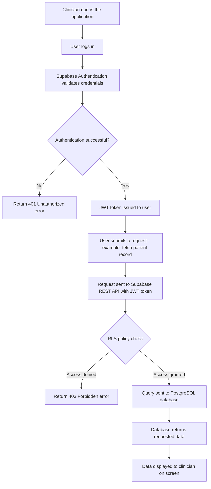
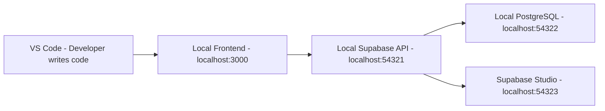

# Supabase Clinical Data System Architecture

This page explains how a clinical data management system built on Supabase is structured and how data flows between its components. Understanding the architecture helps developers and clinical data managers see the big picture before working with individual parts of the system.

---

## System Overview

A Supabase clinical data management system has four main components that work together:

- **Frontend Application** — the interface clinicians and staff use to enter and view patient data
- **Supabase Authentication** — manages user login and controls who can access what data
- **Supabase REST API** — the bridge between the frontend application and the database
- **PostgreSQL Database** — stores all patient records, lab results, and clinical data securely

These four components communicate in a specific order every time a user performs an action — for example registering a new patient or retrieving a lab result.

---

## How Data Flows Through the System

The diagram below shows the complete journey of a data request — from the moment a clinician logs in to the moment they see patient data on their screen.

---

## Component Breakdown

### Frontend Application

The frontend is the part of the system that clinicians and staff interact with directly. It is built using standard web technologies and connects to Supabase using the JavaScript client library.

The frontend handles:
- Displaying patient records and lab results
- Collecting data through forms
- Sending requests to the Supabase REST API

### Supabase Authentication

Before any data can be accessed the system verifies the identity of the user. Supabase Authentication manages this process using JWT tokens — secure digital certificates that confirm who the user is and what they are allowed to do.

Every API request must include a valid JWT token. Without it the system returns a 401 Unauthorized error.

### Supabase REST API

The REST API is the communication layer between the frontend and the database. When a clinician clicks a button to view a patient record the frontend sends a request to the REST API which then retrieves the correct data from the database.

The API also enforces Row Level Security policies — rules that ensure each user only sees data they are authorised to access.

### PostgreSQL Database

The database is where all clinical data is stored permanently. Supabase uses PostgreSQL — one of the most reliable and widely used database systems in healthcare and enterprise environments.

The database stores:
- Patient demographic records
- Laboratory test orders and results
- User authentication data
- Audit logs of data access and changes

### Supabase Studio

Supabase Studio is a visual dashboard that gives database administrators and clinical data managers a way to manage the system without writing code. Through Studio you can:

- View and edit database tables directly
- Create and manage RLS policies
- Monitor API usage and performance
- Run SQL queries for data analysis

---

## Security Architecture

Security is built into every layer of the system:

**Authentication layer** — every user must log in before accessing any data. Supabase issues a JWT token that expires after a set period requiring users to log in again.

**API layer** — every request passes through RLS policy checks before the database is queried. A clinician in the pharmacy department cannot access records from the radiology department even if they are logged in.

**Database layer** — all data is encrypted at rest. Only authorised services can connect to the PostgreSQL database directly.

---

## Local Development Architecture

When running Supabase locally for development and testing the same architecture applies but all services run on your own computer through Docker containers.

This means developers can build and test the full system locally without affecting any live patient data — a critical requirement in clinical environments.

---

## What Is Next

Now that you understand how the system is structured you are ready to:

- Follow the Installation Guide to set up your local environment
- Read the Developer Guide to start integrating with the API
- Refer to the API Reference for available endpoints and code examples